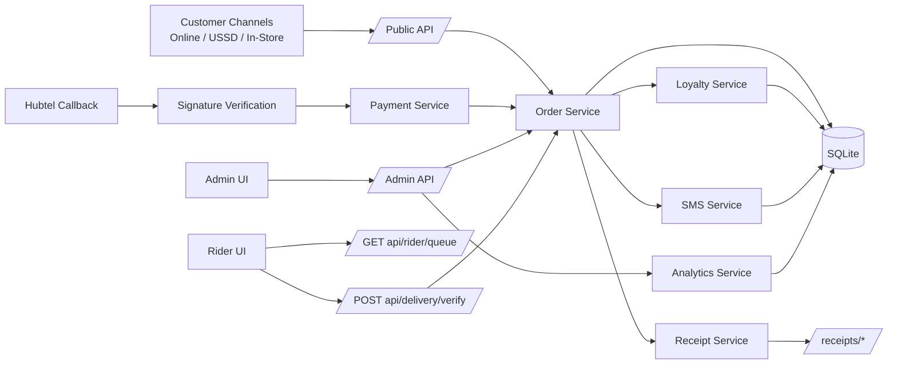
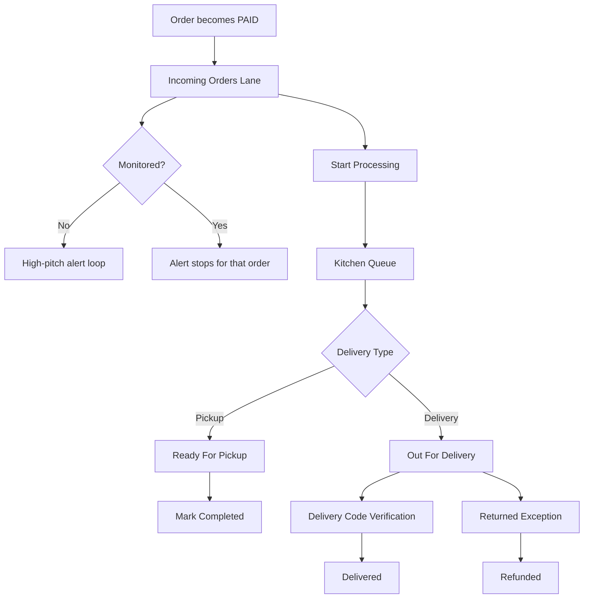
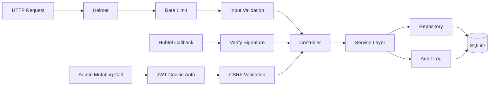

# System Flowchart (Current Implementation)

Last verified against code: 2026-02-12

## 1) End-to-End Architecture

## 2) Operations Board Flow

## 3) Security Control Points

## 4) Surface Map

- Admin: `/admin/*`
- Rider: `/rider/index.html`
- Receipts: `/receipts/*`
- APIs: `/api/*` and `/api/admin/*`
